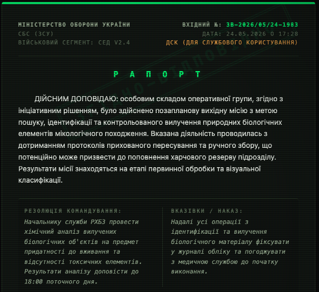

# Zgidno-Vidpovidno (Згідно-Відповідно) 🪖

Just a quick pet project

> **Automated Military Bureaucracy Translator (Програмний комплекс автоматизації бюрократії v2.4)**

An entertaining, full-stack web application that takes mundane, civilian everyday phrases (e.g., *"the dog peed on the router"*, *"I'm going to sleep"*) and translates them into absurdly over-engineered, formal, and deadpan military reports (**Рапорти**) matching the exact tone of Ukrainian army paperwork.

Built with **Astro**, **React**, **Tailwind CSS**, and powered by the highly efficient **Google Gemini 2.5 Flash** API via Google AI Studio's free tier.



---

## 🚀 Features

* **Multi-Branch Simulation:** Dynamically adapts jargon, regulations, and approval comments based on 5 different military branches (Signal & Cyber Security, Land Forces, Air Force, Navy, Unmanned Systems).
* **Structured JSON Output:** The core AI engine outputs precise JSON payloads containing the report, funny custom regulations, operational codes, and simulated electronic document management approvals.
* **Tactical Cyberpunk UI:** A fully responsive, flat-line design utilizing a dark-green terminal aesthetics (`font-mono`, pulsing status badges, and custom watermarks).
* **Few-Shot AI Accuracy:** Pre-trained with 40+ production-grade translation examples to ensure robust contextual understanding without hallucination.

---

## 🛠️ Tech Stack

* **Framework:** [Astro](https://astro.build/) (Hybrid Server-Side Rendering / Static)
* **UI Library:** [React.js](https://react.dev/) + [TypeScript](https://www.typescript.org/)
* **Styling:** [Tailwind CSS](https://tailwindcss.com/)
* **AI Engine:** [Google Generative AI SDK](https://github.com/google/generative-ai-js) (`gemini-2.5-flash`)
* **Deployment:** [Firebase Hosting & App Hosting / Cloud Functions](https://firebase.google.com/)

---

## ⚡ Quick Start

### 1. Clone the repository
```bash
git clone [https://github.com/your-username/zgidno-vidpovidno.git](https://github.com/your-username/zgidno-vidpovidno.git)
cd zgidno-vidpovidno
2. Install dependencies
Bash
npm install
3. Environment Setup
Create a .env file in the root directory and append your Google AI Studio API key:

Code snippet
GEMINI_API_KEY="your_free_ai_studio_gemini_api_key"
4. Run Locally
Bash
npm run dev
Open http://localhost:4321 to view the application in your local environment.

🇺🇦 Документація та Логіка Проєкту (Ukrainian Guide)
🧠 Як це працює (Архітектура)
Додаток побудований без використання важких зовнішніх бекенд-платформ. Вся логіка безпечно обробляється всередині Astro Server Endpoints (API routes), що унеможливлює витік вашого приватного GEMINI_API_KEY на клієнтську сторону.

Користувач вводить фразу (наприклад, "Забув пароль від пошти") та обирає рід військ.

Фронтенд (React-компонент Translator.tsx) відправляє POST-запит на внутрішній ендпоінт /api/translate.

Astro-сервер підхоплює запит, ініціалізує модель gemini-2.5-flash, підставляє відповідний System Prompt та масив готових прикладів із бази даних.

Gemini повертає строго валідований об'єкт JSON, який миттєво рендериться на фронтенді у вигляді військового бланка зі штампами.

📋 Структура Промпту та API Даних
Нейромережа навчена повертати не просто сухий текст, а структурований JSON для чистої інтеграції в UI без використання регулярних виразів (RegEx).

Специфікація вихідного об'єкта:

JSON
{
  "report": "ДІЙСНИМ ДОПОВІДАЮ: особовий склад чергової зміни... [Основний текст рапорту]",
  "resolution": "По факту події... призначити службове розслідування... Контроль покласти на...",
  "order": "Наказ довести до особового складу... Контроль залишаю за собою.",
  "approvers": [
    { "role": "Начальник служби РХБЗ", "status": "ПРИЗНАЧЕНО СЛУЖБОВЕ РОЗСЛІДУВАННЯ" }
  ],
  "regulation": "Стаття 404 Тимчасового кодексу протидії...",
  "authorized_by": "Командир військової частини",
  "operation_code": "КОД-ГІДРАНТ-СПИРТ-200"
}
💥 Правила генерації контенту для розробника
ДІЙСНИМ: Кожен головний рапорт (report) обов'язково починається зі слова "ДІЙСНИМ ДОПОВІДАЮ".

Контекст СЕД (Системи електронного документообігу): Поля resolution, order та масив approvers імітують коментарі реальних посадових осіб армійських чатів чи внутрішніх систем управління (наприклад, резолюції від користувачів k.vernadska або gonezales1978). Якщо подія пов'язана із тваринами — система автоматично підтягує в погоджувачі Начальника кінологічної служби.

🚀 Швидкий деплой на Firebase
Проєкт готовий до безкоштовного розгортання на Firebase (Spark Tier). Для деплою серверного рендерингу (SSR) переконайтеся, що в Astro підключено відповідний адаптер.

Bash
# Авторизація та ініціалізація
firebase login
firebase init

# Налаштування секретів для Cloud Functions (якщо використовуються)
firebase functions:secrets:set GEMINI_API_KEY="твоє_реальне_значення_ключа"

# Запуск деплою
firebase deploy
📝 License
This project is open-source and available under the MIT License. Feel free to use it to clean up your local repo or automate your own bureaucratic tasks! 😂
